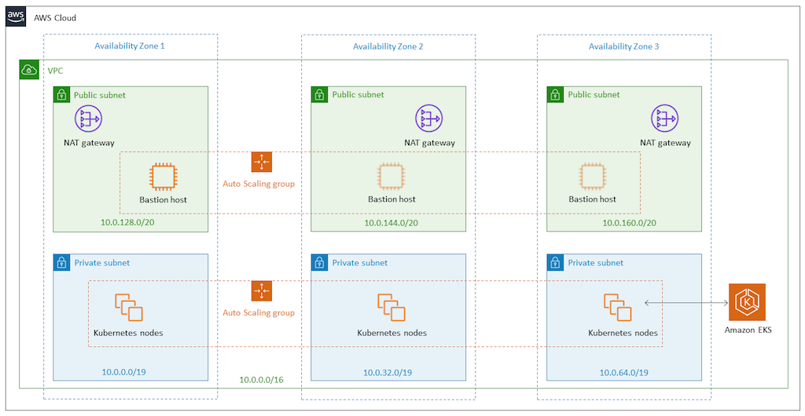
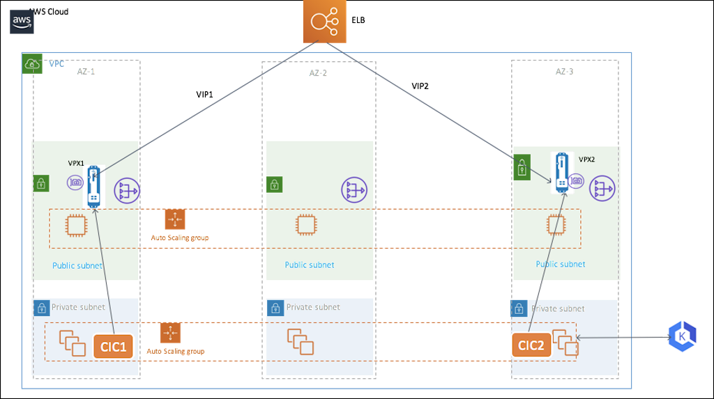
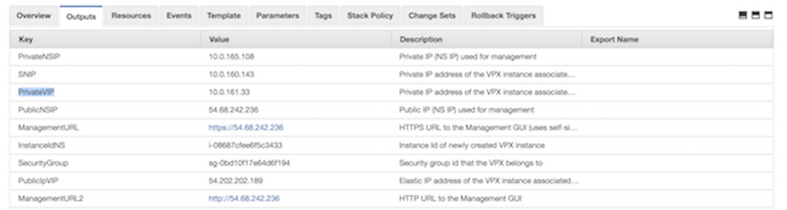
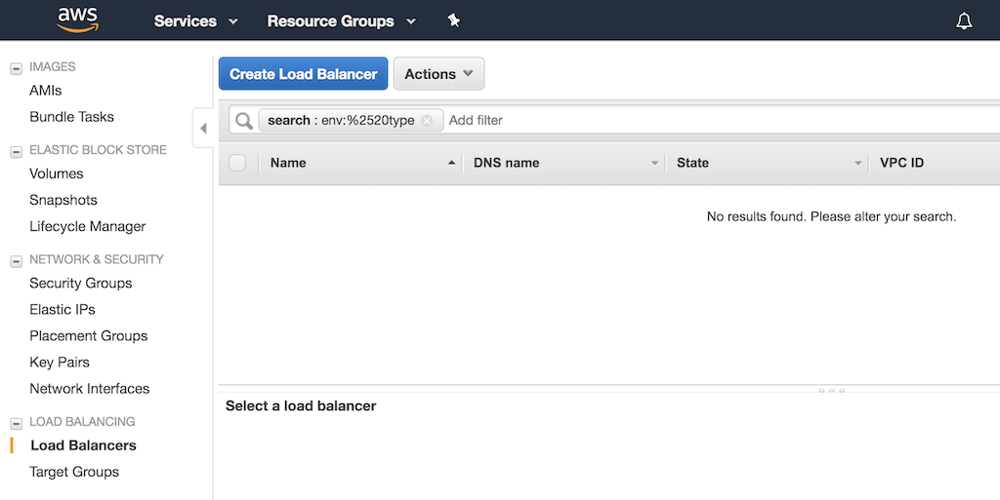
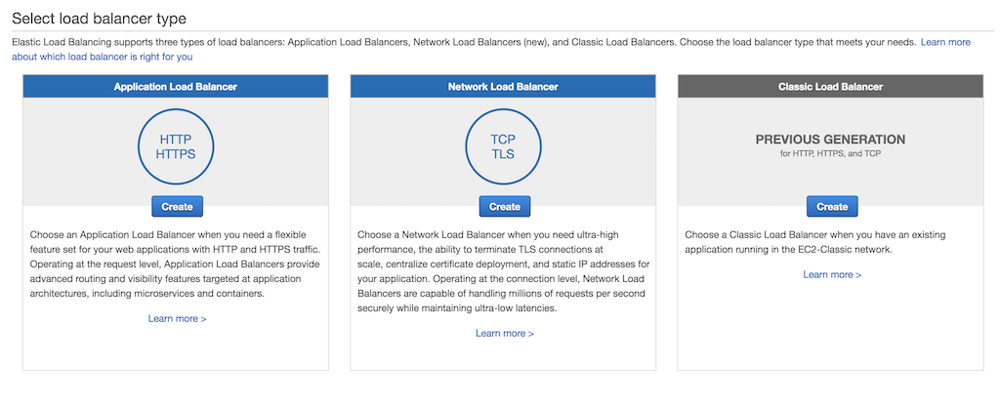
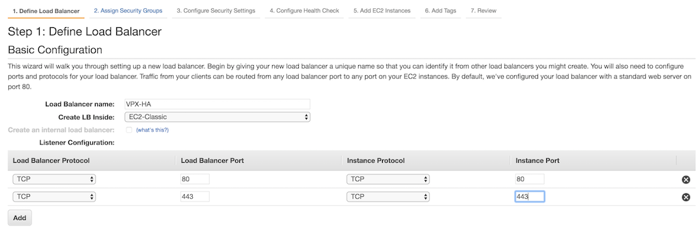
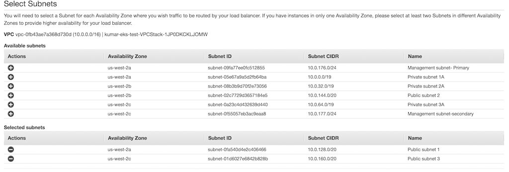
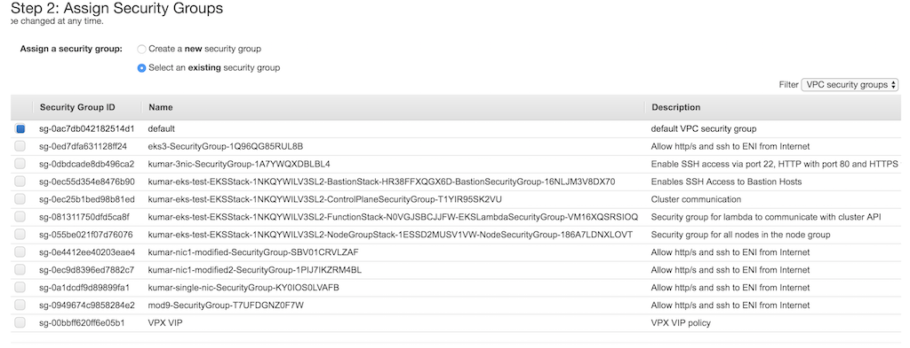
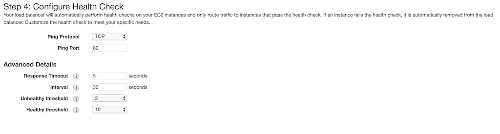
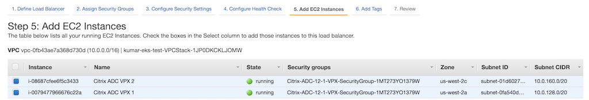

# Deploying Citrix ADC VPX in Active-Active HA in EKS environment using Amazon Classic Loadbalancer and Citrix Ingress Controller

This guide explains how to create our recommended solution for a highly available, active‑active deployment of VPX instances in multiple Availability zones in the Amazon Web Services (AWS) cloud for the Elastic Container Service For Kubernetes (EKS) workloads. The solution combines the AWS Classic LoadBalancer(ELB) for fast and efficient handling of Layer 4 traffic with Citrix ADC VPX for advanced, Layer 7 features such as advanced load balancing, caching and content‑based routing. The combined solution gives the best of Loadbalancing and advanced and time tested features Layer 7 features of Citrix ADC.
This guide explains how to set up an AWS ELB in front of one pair of VPX load balancers.
>**Note:**
    >
    > To increase the resiliency of the solution, you can increase the no of VPX instances, and follow the same steps for the deployment.
    
##  EKS - Elastic container service for Kubernetes

AWS provides EKS - Elastic Container service For Kubernetes  which is a managed kubernetes service provided by EKS. Amazon EKS runs the Kubernetes management infrastructure for the user across multiple AWS availability zones to eliminate a single point of failure.  Amazon EKS runs the Kubernetes management infrastructure across multiple AWS Availability Zones, automatically detects and replaces unhealthy control plane nodes, and provides on-demand upgrades and patching. User simply provision worker nodes and connect them to the provided Amazon EKS endpoint.
This tutorial assumes that you are familiar with EKS and you  have already deployed an EKS cluster. To deploy a EKS cluster, you can refer [quick-start for deploying EKS cluster](https://github.com/aws-quickstart/quickstart-amazon-eks)
This includes CloudFromation templates to bring up an EKS cluster which is deployed on multiple Availability zones for higher resiliency. Following diagram shows the architecture of EKS cluster, it uses 3 Public subnet and 3 Private subnets deployed across 3 availability zones.
 
 


## Solution Overview 


 
Here AWS ELB handles Layer 4 TCP connections and balances traffic using a flow hash routing algorithm. An AWS ELB has a DNS name to which an IP address is assigned dynamically and this can be used to add an Alias A record for your domain in Route53. 

The AWS ELB listens for incoming connections as defined by its listeners. Each listener forwards a new connection to one of the available VPX instances. VPX instance that has received the traffic can do Layer 7 load balancing to Kubernetes pods along with other Layer 7 functionalities like respinder policy, Rewrite Policy, SSL offloading, Authentication policies etc.
One instance of Citrix ingress controller is deployed in EKS cluster for each VPX instances that will configure the Ingress objects in Kubernetes cluster on respective VPX instances. Since both Citrix ingress controller are deployed with same ingress class, ingress objects are configured on both VPX instances.

   


## Deploying VPX instances

Use the [Amazon Cloudformation Template for VPX](templates/eks_single_nic/README.md) to deploy the VPX instances which deploys one instance of  citrix ADC VPX with single ENI on a given subnet and also configures  Management IP, VIP and a SNIP.  Deploy two VPX instances on two availability zones by specifying the same VPX and different public subnet.
Succesful deployment of CloudFormation template gives an output with IP address details, this can be used for setting up Citrix ingress controller. 



.**Note:**
     >
     > Note that the CLoudformation deploys a VPX instance with primary IP address as VIP and secondary IP address as Management. This is done to ensure the ELB to load balance to VIP , as ELB can only load balance to primary IP address of eth0 of an instance.

Once the instances are  successfully deployed, you must edit the security groups to allow traffic from EKS node group security group. Also you must change the EKS node group security group to allow traffic from VPX instances. 


## Deploying Citrix Ingress Controller(CIC)

Next step is to deploy the Citrix Ingress controller in the Kuberentes cluster to configure the VPX instances from Kuberentes cluster. The detailed deployment of Citrix ingress Controller is given [here](https://developer-docs.citrix.com/projects/citrix-k8s-ingress-controller/en/latest/deploy/deploy-cic-yaml/). 
Once the VPX instances are up, you must setup a system user account in VPX instances for Citrix Ingress Controller to login to VPX instances. 

1.  Deployment of Citrix Ingress Controller  
    Edit the [citrix-ingress-controller.yaml](manifest/citrix-ingress-controller.yaml) to  Specify  the details of VPX instance 1 in the cic-k8s-ingress-controller-1 Pod and details of VPX instance 2 in the cic-k8s-ingress-controller-2. Replace `NS_IP` with  Private NSIP address , `NS_VIP` with  Private VIP address  and specify the username ans password Kubernetes secrets for the respective VPX instance. 
     
    Deploy citrix-ingress-controller.yaml
    
    ```
    kubectl apply -f citrix-ingress-controller .yaml
    
    ```

	
2. Ensure that both pods are UP and running. Also verify that CIC is able to  connect to the respective VPX instance. 

   ```  
   kubectl logs <CIC pod name> 

   ```

Now that both CIC pods are running on EKS cluster, any Kubernetes Ingress resources configured with ingress-class 'citrix' will be configured on both VPX instances. 


## Setting up  Amazon Classic Load balancer(ELB)
1. Log in to the [AWS Management Console for EC2](https://console.aws.amazon.com/ec2/).

2. In the left navigation bar, select Load Balancers, then click the  Create Load Balancer  button.

   
 

3. In the Select load balancer type window that opens, click the  `Create`  button in the Classic Load balancer panel (Right most)

   
 

4. In the 'Define Load Balancer', Type a name for the Load balancer and  Select your VPX in "Create LB Inside:" field.  Select Load balancer Protocol and instance protocol as 'TCP'  and add ports which needs to be loadbalanced. Figure shows port 80 and port 443 is added to load balancer web traffic. 

   
 

5. In the same page , select two public subnets in two different Availability zones for the Classic Load balancer for the traffic to be routed. These subnets are same as where the VPX instances are deployed.

   

5. In the "Assign Security Group" page, select a security group for the ELB instance. It could be same as the security group attached to VPX ENI or it could be new security group. If you are using a new security group, make sure to allow traffic to VPX security group from the ELB security group and vice versa. 

   

6. In the "Configure Health Check" page, select the configuration for the health check. By default health check is TCP ping on port 80, optionally you can do the health check on port 443. 

   

7. In the "Add EC2 Instances" page, select Two VPX instances which was deployed earlier. 

  

8. In the next page,add any tags and press "create Loadbalancer", review and create. 


## Testing 
Now that VPX, ELB and Citrix Ingress controller instances are deployed, we can proceed with deploying a sample service to test the actual load balance. 

Deploy a sample service and ingress using [app.yaml](manifest/app.yaml)

```
kubectl apply -f app.yaml

```

You can login to VPX and verify that Content switching Vservers are succesfully configured on both VPX instances. 

```
sh cs vserver
1)	k8s-10.0.139.87:80:http (10.0.139.87:80) - HTTP	Type: CONTENT
	State: UP
	Last state change was at Fri Apr 12 14:24:13 2019
	Time since last state change: 3 days, 03:09:18.920
	Client Idle Timeout: 180 sec
	Down state flush: ENABLED
	Disable Primary Vserver On Down : DISABLED
	Comment: uid=NNJRYQ54VM2KWCXOERK6HRJHR4VEQYRI7U3W4BNFQLTIAENMTHWA====
	Appflow logging: ENABLED
	Port Rewrite : DISABLED
	State Update: DISABLED
	Default: 	Content Precedence: RULE
	Vserver IP and Port insertion: OFF
	L2Conn: OFF	Case Sensitivity: ON
	Authentication: OFF
	401 Based Authentication: OFF
	Push: DISABLED	Push VServer:
	Push Label Rule: none
	Listen Policy: NONE
	IcmpResponse: PASSIVE
	RHIstate:  PASSIVE
	Traffic Domain: 0


```

Now you can access your application test.example.com using DNS name of the ELB instance.

```

# curl -H 'Host: test.example.com' <DNS name of the ELB>
% curl -H 'Host: test.example.com' http://VPX-HA-829787521.us-west-2.elb.amazonaws.com

```

 To delete the deployment, use the following command.
        
```
kubectl delete -f app.yaml

```


## Troubleshooting

1. CloudFormation stack failure
   - Ensure that IAM user or role has sufficient privilege to create EC2 instances and Lambda configurations
   - Ensure that you haven't exceeded the resource quota   

2. CIC can not communicate with VPX instances  

   - Ensure that username and password is correct in Citrix-ingress-controller.yaml
   - Ensure that VPX security group allows traffic on port 80 and 443 from EKS node group security group.

3. The services are DOWN in VPX instances  
   - Ensure that VPX traffic can reach the EKS cluster by modifying the security group of EKS node group to allow traffic from VPX security group.

4. Traffic not routing to VPX instance from ELB.  
   - Ensure that security group of VPX allow traffic from ELB security group.


